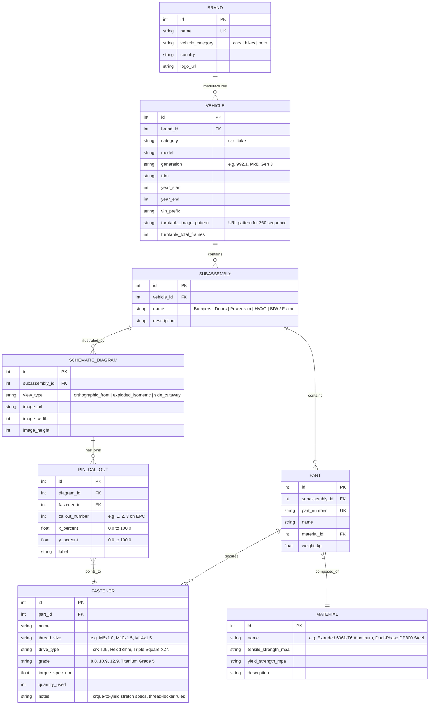

# Automotive Blueprint & Engineering Platform - Implementation Roadmap

This document outlines the system architecture, relational database schema, REST API contracts, multimodal EPC extraction pipeline, and prioritized engineering tasks for the Automotive Blueprint & Engineering Platform.

---

## 1. System Architecture

```
                                  +---------------------------------------+
                                  |     Next.js 15 App Router Frontend    |
                                  |   TypeScript / Tailwind CSS / Lucide   |
                                  +-------------------+-------------------+
                                                      |
                   +----------------------------------+----------------------------------+
                   |                                  |                                  |
                   v                                  v                                  v
       +-----------------------+          +-----------------------+          +-----------------------+
       |   Hero Portal & Daily |          |  Global A-Z Directory |          | 360 Turntable & Deep  |
       |  Trivia (Cars vs Bikes|          |   & Generation Picker |          | Blueprint Canvas (2D) |
       +-----------------------+          +-----------------------+          +-----------------------+
                                                      |
                                                      | HTTPS / REST / JSON
                                                      v
                                  +---------------------------------------+
                                  |       FastAPI High-Speed Gateway      |
                                  |    (Async SQLAlchemy 2.0 / Pydantic)  |
                                  +-------------------+-------------------+
                                                      |
                   +----------------------------------+----------------------------------+
                   |                                                                     |
                   v                                                                     v
       +-----------------------+                                             +-----------------------+
       | Storage Engine        |                                             | Multimodal AI Engine  |
       | • SQLite (aiosqlite)  |                                             | (Google GenAI Gemini) |
       | • Postgres (asyncpg)  |                                             | Scanned EPC Schematics|
       | Vehicle->Subassembly  |                                             | -> Structured Pins    |
       | ->Part->Fastener/Mat  |                                             +-----------------------+
       +-----------------------+
```

---

## 2. Relational Domain Schema (Automotive & Motorcycle Engineering)



---

## 3. Implementation Status

### Phase 1: Relational Schema & Backend Engineering
- [x] **1.1 Database Models (`backend/app/models/automotive.py`)**:
  - `Brand`, `Car`, `Subsystem` (Bumpers, Doors, Powertrain, HVAC, BIW), `Part`, `Fastener`.
  - Fasteners include `thread_size`, `drive_type`, `grade`, `torque_spec_nm`, `quantity_used`, `x_percent`, `y_percent`.
- [x] **1.2 Seed Script (`backend/seed.py`)**:
  - **Porsche 911 GT3 (992.1)** and **VW Golf R (Mk8)** with complete mock fastener coordinates across all 5 subsystems.
- [x] **1.3 API Routes (`backend/app/api/automotive_routes.py`)**:
  - `GET /api/automotive/brands`
  - `GET /api/automotive/subsystems`
  - `GET /api/automotive/cars`
  - `GET /api/automotive/cars/{id}` (nested parts & fasteners)
  - `GET /api/automotive/cars/{id}/fasteners`
- [x] **1.4 Backend Service**:
  - Running live on `http://localhost:8000`.

### Phase 2: Interactive Blueprint UI & Frontend Integration
- [x] **2.1 Frontend API Client (`web/lib/api.ts`)**:
  - Direct integration with FastAPI endpoints.
- [x] **2.2 Hero & Daily Automotive Trivia (`web/components/hero/hero.tsx`)**:
  - Daily automotive trivia with technical torque & titanium rod insight.
  - Dual portal selector (`Cars` vs `Motorcycles`).
- [x] **2.3 Global A-Z Brand Directory & Car Selector (`web/components/directory/directory.tsx`)**:
  - A-Z alphabet bar, brand chips, live search, and dynamic car selector cards.
- [x] **2.4 Deep Technical Blueprint Canvas (`web/components/blueprint/blueprint-canvas.tsx`)**:
  - Orthographic technical canvas with zoom controls, coordinate grid overlay, and pulsing pins.
  - Hardware inspector sidebar displaying thread sizes, drive types, tensile grades, torque limits, and reassembly alerts.
  - Interactive specification table linked to callout pins.
- [x] **2.5 Frontend Dev Server**:
  - Next.js 15 Turbopack running live on `http://localhost:3000`.

### Phase 3: 360-Degree Turntable & Multimodal EPC Ingestion (Next Up)
- [ ] 360-degree 2D exterior turntable viewer with drag scrub rotation.
- [ ] Multimodal EPC schematic image ingestion script using Gemini Vision.
